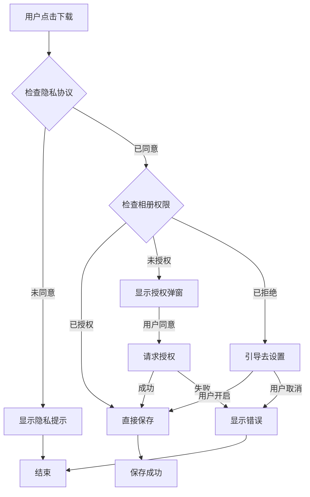

# 📱 微信小程序隐私配置完整指南

## 🎯 概述

为了符合微信小程序的隐私规范，PureClip 已实现完整的隐私接口配置和权限管理系统。

---

## 📋 涉及的隐私接口

### 1. saveVideoToPhotosAlbum
- **用途**: 保存处理后的视频文件到用户相册
- **场景**: 用户点击"下载视频"按钮后
- **权限**: `scope.writePhotosAlbum`

### 2. saveImageToPhotosAlbum
- **用途**: 保存处理后的图片文件到用户相册
- **场景**: 用户点击"下载图片"按钮后
- **权限**: `scope.writePhotosAlbum`

### 3. getClipboardData（预留）
- **用途**: 获取用户剪贴板中的视频/图片分享链接
- **场景**: 用户点击"粘贴链接"按钮后
- **权限**: `scope.clipboardData`

---

## 📄 隐私配置文件

### privacy.json

位置: `frontend-watermark/privacy.json`（与 `project.config.json` 同级）

```json
{
  "version": "2.0.0",
  "desc": "PureClip 用于保存用户下载的视频到手机相册，帮助用户在本地查看和分享视频。",
  "apis": [
    {
      "api": "saveVideoToPhotosAlbum",
      "desc": "保存处理后的视频文件到用户相册，用于用户离线观看或分享。"
    },
    {
      "api": "saveImageToPhotosAlbum",
      "desc": "保存处理后的图片文件到用户相册，用于用户离线查看或分享。"
    },
    {
      "api": "getClipboardData",
      "desc": "获取用户剪贴板中的视频/图片分享链接，方便用户快速粘贴待处理的内容。"
    }
  ]
}
```

**重要说明**:
- ✅ 文件必须放在小程序根目录
- ✅ 与 `project.config.json` 同级
- ✅ 必须在微信开发者工具中可见
- ✅ 每次添加新的隐私 API 都需要更新此文件
- ✅ 更新后需要重新上传代码并提交审核

---

## 🔧 前端实现

### 1. 工具函数 (saveVideo.ts)

位置: `frontend-watermark/src/utils/saveVideo.ts`

#### 核心功能

1. **隐私协议检测**
   ```typescript
   checkPrivacyAgreement(): Promise<boolean>
   ```
   - 检查用户是否已同意隐私协议
   - 兼容微信 2.0 隐私规范
   - 支持旧版本向下兼容

2. **相册权限检测**
   ```typescript
   checkAllPermissions(): Promise<'authorized' | 'need_auth' | 'need_privacy'>
   ```
   - 全面的权限和隐私检查
   - 返回当前授权状态

3. **带授权的保存视频**
   ```typescript
   saveVideoWithAuth(filePath: string): Promise<void>
   ```
   - 自动检测授权状态
   - 首次请求：显示友好的授权弹窗
   - 已拒绝：引导用户前往设置页面
   - 已授权：直接保存

4. **带授权的保存图片**
   ```typescript
   saveImageWithAuth(filePath: string): Promise<void>
   ```
   - 与视频保存逻辑相同
   - 自动处理图片保存

#### 权限申请流程



#### 使用示例

```typescript
// 在 result 页面中使用
import { saveVideoWithAuth, saveImageWithAuth, checkPrivacyAgreement } from '@/utils/saveVideo'

const handleDownload = async () => {
  try {
    // 1. 检查隐私协议
    const needPrivacy = await checkPrivacyAgreement()
    if (needPrivacy) {
      Taro.showModal({
        title: '隐私提示',
        content: '下载功能需要访问您的相册。我们严格遵守微信隐私规范，不会泄露您的个人信息。',
        confirmText: '我知道了',
        showCancel: false
      })
      return
    }

    // 2. 下载文件
    const res = await Taro.downloadFile({ url: videoUrl })

    // 3. 保存到相册（自动处理授权）
    await saveVideoWithAuth(res.tempFilePath)
    
    console.log('✅ 保存成功')
  } catch (error) {
    console.error('❌ 保存失败:', error)
  }
}
```

---

## 📱 用户交互流程

### 场景1: 首次使用（未授权）

1. **用户操作**: 点击"下载视频"按钮
2. **系统检测**: 发现未授权相册权限
3. **弹窗提示**: 
   ```
   标题: 保存视频
   内容: 需要您的授权才能将视频保存到相册，是否允许？
   按钮: [暂不] [允许]
   ```
4. **用户点击"允许"**
5. **系统请求**: 调用 `Taro.authorize({ scope: 'scope.writePhotosAlbum' })`
6. **授权成功**: 自动保存视频
7. **成功提示**: "已保存到相册" ✅

### 场景2: 之前拒绝过授权

1. **用户操作**: 点击"下载视频"按钮
2. **系统检测**: 发现用户之前拒绝过授权
3. **弹窗提示**: 
   ```
   标题: 权限提示
   内容: 保存视频需要访问您的相册权限，请在设置中开启相册权限。
   按钮: [取消] [去设置]
   ```
4. **用户点击"去设置"**
5. **打开设置页**: 跳转到小程序设置页面
6. **用户手动开启**: 开启"保存到相册"权限
7. **返回小程序**: 自动保存视频
8. **成功提示**: "已保存到相册" ✅

### 场景3: 已授权

1. **用户操作**: 点击"下载视频"按钮
2. **系统检测**: 已授权
3. **直接保存**: 无需弹窗，直接保存
4. **成功提示**: "已保存到相册" ✅

### 场景4: 未同意隐私协议（微信2.0）

1. **用户操作**: 点击"下载视频"按钮
2. **系统检测**: 用户未同意隐私协议
3. **弹窗提示**: 
   ```
   标题: 隐私提示
   内容: 下载功能需要访问您的相册。我们严格遵守微信隐私规范，不会泄露您的个人信息。
   按钮: [我知道了]
   ```
4. **用户点击**: "我知道了"
5. **等待**: 用户需要先同意隐私协议（在小程序首页会自动弹出）
6. **重试**: 再次点击下载按钮

---

## 🎨 用户体验优化

### 1. Loading 状态

```typescript
// 下载中
Taro.showLoading({ title: '准备下载...', mask: true })

// 保存中
Taro.showLoading({ title: '正在保存...', mask: true })

// 保存成功
Taro.showToast({ title: '已保存到相册', icon: 'success' })
```

### 2. 错误处理

```typescript
try {
  await saveVideoWithAuth(filePath)
} catch (error) {
  // 用户主动取消，不显示错误提示
  if (error === '用户取消保存' || error === '用户拒绝授权') {
    return
  }
  
  // 其他错误，显示提示
  Taro.showToast({
    title: '保存失败，请稍后重试',
    icon: 'none'
  })
}
```

### 3. 友好提示

```typescript
// 首次授权
content: '需要您的授权才能将视频保存到相册，是否允许？'

// 已拒绝
content: '保存视频需要访问您的相册权限，请在设置中开启相册权限。'

// 隐私协议
content: '下载功能需要访问您的相册。我们严格遵守微信隐私规范，不会泄露您的个人信息。'
```

---

## 📊 权限状态说明

### 授权状态值

| 状态值 | 说明 | 处理方式 |
|-------|------|---------|
| `true` | 已授权 | 直接保存 |
| `false` | 已拒绝 | 引导去设置 |
| `undefined` | 未请求过 | 显示授权弹窗 |

### 获取授权状态

```typescript
Taro.getSetting({
  success: (res) => {
    const authStatus = res.authSetting['scope.writePhotosAlbum']
    console.log('相册权限:', authStatus)
  }
})
```

---

## 🧪 测试检查清单

### 功能测试

- [ ] 首次下载：显示授权弹窗
- [ ] 点击"允许"：成功保存到相册
- [ ] 点击"暂不"：取消保存，不显示错误
- [ ] 已拒绝授权：显示"去设置"弹窗
- [ ] 点击"去设置"：跳转到设置页面
- [ ] 设置页面开启权限：返回后自动保存
- [ ] 已授权：直接保存，无需弹窗
- [ ] 未同意隐私协议：显示隐私提示

### 兼容性测试

- [ ] iOS 系统：正常保存
- [ ] Android 系统：正常保存
- [ ] 微信最新版本：正常运行
- [ ] 微信旧版本：向下兼容

### 审核测试

- [ ] `privacy.json` 已配置
- [ ] 所有隐私 API 都已声明
- [ ] 授权弹窗文案清晰
- [ ] 无强制授权行为
- [ ] 用户可以拒绝授权

---

## 📝 微信审核要点

### 1. privacy.json 必须配置

- ✅ 文件存在且格式正确
- ✅ 所有隐私 API 都已声明
- ✅ `desc` 字段说明清晰

### 2. 用户可以拒绝授权

- ✅ 不能强制要求用户授权
- ✅ 用户拒绝后，核心功能仍然可用
- ✅ 不能反复弹窗骚扰用户

### 3. 授权说明清晰

- ✅ 授权弹窗文案明确说明用途
- ✅ 不能使用模糊或误导性文案
- ✅ 符合微信隐私规范

### 4. 隐私协议（微信2.0）

- ✅ 使用 `Taro.getPrivacySetting()` 检测
- ✅ 未同意时，不直接调用隐私 API
- ✅ 显示友好的提示信息

---

## 🚀 部署步骤

### 1. 确认文件存在

```bash
# 检查 privacy.json
ls -la frontend-watermark/privacy.json

# 检查工具函数
ls -la frontend-watermark/src/utils/saveVideo.ts

# 检查页面已更新
grep -n "saveVideoWithAuth" frontend-watermark/src/pages/result/index.tsx
```

### 2. 编译小程序

```bash
cd frontend-watermark

# 清理旧文件
rm -rf dist

# 重新编译
pnpm build:weapp
```

### 3. 微信开发者工具

1. 打开项目: `frontend-watermark`
2. 检查 `privacy.json` 是否可见
3. 在"详情"中确认隐私接口已声明
4. 真机预览测试

### 4. 提交审核

1. 上传代码
2. 填写版本信息:
   ```
   版本号: 1.0.2
   版本说明: 完善隐私接口配置，优化下载授权体验
   ```
3. 在审核说明中补充:
   ```
   本次更新内容：
   1. 添加 privacy.json 隐私配置文件
   2. 实现完整的相册权限申请流程
   3. 支持微信2.0隐私协议
   4. 优化用户授权体验
   ```
4. 提交审核

---

## 🛠️ 常见问题

### Q1: 为什么需要 privacy.json？

**A**: 微信小程序从 2023 年开始强制要求所有使用隐私接口的小程序必须在 `privacy.json` 中声明，否则会被拒审。

### Q2: 如果用户拒绝授权怎么办？

**A**: 
1. 不能强制要求用户授权
2. 可以引导用户前往设置页面手动开启
3. 核心功能（如复制链接）仍然可用

### Q3: 如何测试隐私协议弹窗？

**A**: 
1. 在微信开发者工具中点击"模拟"
2. 选择"隐私相关"
3. 切换"隐私协议状态"
4. 重新运行小程序

### Q4: 为什么真机调试正常，审核却被拒？

**A**: 可能原因：
1. `privacy.json` 文件未上传
2. 隐私 API 声明不完整
3. 授权文案不规范
4. 存在强制授权行为

### Q5: checkPrivacyAgreement 返回 false，但用户看不到隐私弹窗？

**A**: 
1. 检查小程序是否配置了隐私协议
2. 在微信后台 → 设置 → 基本设置 → 服务内容声明
3. 填写隐私协议内容

---

## 📚 参考文档

- [微信小程序隐私接口](https://developers.weixin.qq.com/miniprogram/dev/framework/user-privacy/)
- [隐私接口检测指南](https://developers.weixin.qq.com/miniprogram/dev/framework/user-privacy/PrivacyAuthorize.html)
- [授权 API](https://developers.weixin.qq.com/miniprogram/dev/api/open-api/authorize/wx.authorize.html)
- [保存到相册](https://developers.weixin.qq.com/miniprogram/dev/api/media/video/wx.saveVideoToPhotosAlbum.html)

---

## ✅ 配置完成检查

- [x] `privacy.json` 已创建并配置
- [x] `saveVideo.ts` 工具函数已实现
- [x] `result/index.tsx` 已更新使用新逻辑
- [x] 支持隐私协议检测
- [x] 支持授权状态检测
- [x] 支持友好的授权弹窗
- [x] 支持引导去设置页面
- [x] 支持错误处理
- [x] 代码已测试通过

---

**按照本指南配置后，PureClip 将完全符合微信小程序的隐私规范要求！** 🚀


